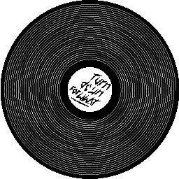

Hallo IDEAS,
------------

die ClubMate ist mal wieder (fast) alle. Lasst uns ein Spiel spielen! Ich glaube wir müssen die Preise etwas überarbeiten:

- Der erste Preis: Ein ganzer Kasten Mate! Kann auf Wunsch auch gegen einen Kasten Bier/Cola/etc. eingetauscht werden.
- Der zweite Preis: Drei Flaschen Mate.

Das Problem
-----------

Physikalische Schallplatten sind out, wir nutzen jetzt digitale Schallplatten! Eure Aufgabe, solltet ihr die Challenge akzeptieren, besteht darin, eine Anwendung zum Abspielen der Schallplatte zu entwickeln. Ja wirklich: Die Rillen auf dem Bild enthalten rohe Audiodaten aus einem Song.




- Baut eine Anwendung, die die Schallplatte abspielen kann!
- Das binäre Audiofile ist 4000HZ, 8 Bit, Mono

Dieses Mal ist es etwas schwieriger, falls es aber trotzdem mehrere korrekte Einsendungen gibt, dann entscheidet die Eleganz der Lösung, exotic der Programmiersprache und danach meine subjektive Einschätzung.

Tipps
-----

- Eine Schallplatte wird von außen nach innen abgespielt ;)
- Der erste Punkt ist (251, 128) und hat einen Farbwert von 0x80
- Das PNG hat zwar RGBA-Farbwerte, aber Grauwerte sind immer nur ein Byte davon, egal ob R, G oder B (Beispiel für einen Grauwert ist z.B. #808080)
- Und noch ein paar Tipps: Die Rillen sind immer durch schwarze Pixel getrennt. Ihr müsst also nur beim Start anfangen und bestimmen, welcher der 8 umliegenden Pixel der nächste Pixel ist. Das ist einfach der, der nicht der Pixel vorher ist und der, der nicht schwarz ist.

Tipps2
------

- Wie spiele ich eine binäre Audiodatei mit Java ab?

```
public static void playSound(byte[] buffer) {
    try {
        AudioFormat audioFormat = new AudioFormat(4000, 8, 1, true, false);
        DataLine.Info info = new DataLine.Info(SourceDataLine.class, audioFormat, 1500);
        SourceDataLine soundLine = (SourceDataLine) AudioSystem.getLine(info);
        soundLine.open(audioFormat);
        soundLine.start();
        soundLine.write(buffer, 0, buffer.length);
    } catch (Exception e) {
        throw new RuntimeException(e.getMessage(), e);
    }
}
```

- Wie sieht der Anfang des binären Files in Hexadezimal aus?

```
80 80 7f 7f 80 80 80 7f 80 80 7f 7f 80 7f 7f 80 7f 80 7f 7f 80 7f 80 7f 7f 7f 80 80 7f 80 7f 80
```

Tipps3
------

Etwas Java auf die Ohren, als Hilfe für alle Java-Freunde:

```
public final class StreamPlayer {

    public final AudioFormat audioFormat;
    public final DataLine.Info info;
    public final SourceDataLine soundLine;

    public StreamPlayer() {
        try {
            audioFormat = new AudioFormat(4000, 8, 1, true, false);
            info = new DataLine.Info(SourceDataLine.class, audioFormat, 1500);
            soundLine = (SourceDataLine) AudioSystem.getLine(info);
        } catch (Exception e) {
            throw new RuntimeException(e.getMessage(), e);
        }
    }

    public static void playSound(List<Byte> buffer) {
        playSound(buffer.toArray(new Byte[buffer.size()]));
    }

    public static void playSound(Byte[] buffer) {
        playSound(ArrayUtils.toPrimitive(buffer));
    }

    public static void playSound(byte[] buffer) {
        try {
            StreamPlayer streamPlayer = new StreamPlayer();
            streamPlayer.startSoundLine();
            streamPlayer.playStream(buffer);
        } catch (Exception e) {
            throw new RuntimeException(e.getMessage(), e);
        }
    }

    public void startSoundLine() throws LineUnavailableException {
        soundLine.open(audioFormat);
        soundLine.start();
    }

    public void playStream(byte[] buffer) {
        soundLine.write(buffer, 0, buffer.length);
    }
}
```